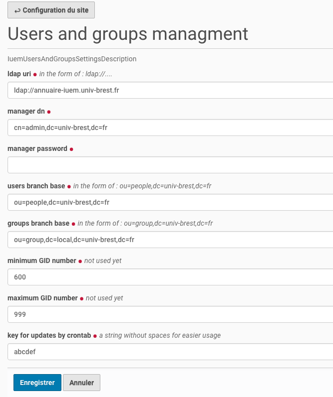

================
La configuration
================

Utiliser le ``Control panel`` standard du site, par la vue : ``@@overview-controlpanel``.

On y arrive par le menu **Configuration du site** quand on a les droits *Administrateur* :

Et utiliser le panneau de controle de la configuration de ce module :

Et obtenir la page de configuration ci-dessous :

Les noms des champs sont explicites mais on peut tout de même préciser les éléments suivants :

* Pour l'IUEM, on prendra soin de n'utiliser que la branche locale pour les groupes::

   ou=group,dc=local,dc=univ-brest,dc=fr

* les champs ``minimum GID number`` et ``maximum GID number`` ne sont pas utilisés dans cette
  première version de module.

* la clé qui est demandée doit être aussi utilisée pour la mise en oeuvre des ``cron``.
  Voir le chapitre qui décrit cette fonctionnalité : :doc:`cron`

