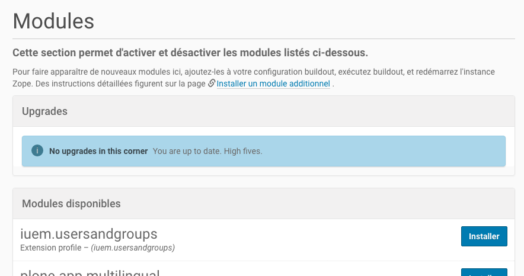

==============
L'installation
==============

L'installation de ce module se fait comme tout autre module développé
à l'IUEM, c'est-à-dire en précisant la source.

Ajouter le nom du module à la liste des modules
===============================================

::

   eggs +=
       ...
       iuem.usersandgroups
       ...

Ajouter le nom du module à la liste des modules à aller chercher si non présents dans le répertoire ``src``
===========================================================================================================

::

   auto-checkout +=
       ...
       iuem.usersandgroups
       ...

Ajouter la source de ce module
==============================

::

   [sources]
   ...
   iuem.usersandgroups  = git gitiuem:iuem.usersandgroups.git

Regénérer l'instane et la redémarer
===================================

::

   bin/buildout

Activer le module
=================

