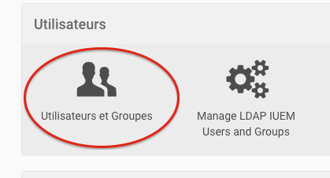

============================================================
Droits pour accéder à la gestion des utilisateurs et groupes
============================================================

Un rôle spécifique avec permission particulière a été mise en place, qui permet de gérer
les droits d'accès à la gestion des utilisateurs.

.. note:: il faut distinguer ici la gestion des utilisateurs et la configuration du
   module. Cette dernière opération n'est permise qu'à un *Administrateur*.

La déclaration de cette permission est faite dans le fichier principal ``configure.zcml``::

     <permission
        id="iuem_users_groups.manage"
        title="iuem.usersandgroups: Manage IUEM Users and Groups"
      />

Un rôle, associé à cette permission est déclaré dans ``profile/default/rolemap.xml``::

     <permissions>
       <permission name="iuem.usersandgroups: Manage IUEM Users and Groups" acquire="True">
         <role name="Manager"/>
         <role name="Site Administrator"/>
        <role name="IUEM Users Manager"/>
       </permission>
     </permissions>

On constate ici que la permission en question est automatiquement alouée aux
rôles ``Manager`` (ou *Administrateur*) et ``Site Administrator`` (ou *Adminitrateur de site*).

Un rôle supplémentaire est défini : ``IUEM Users Manager``.

Il est donc possible d'attribuer ce rôle à un utilisateur particulier et/ou
à un groupe par l'interface de gestion des utilisateurs et groupes de Plone :

