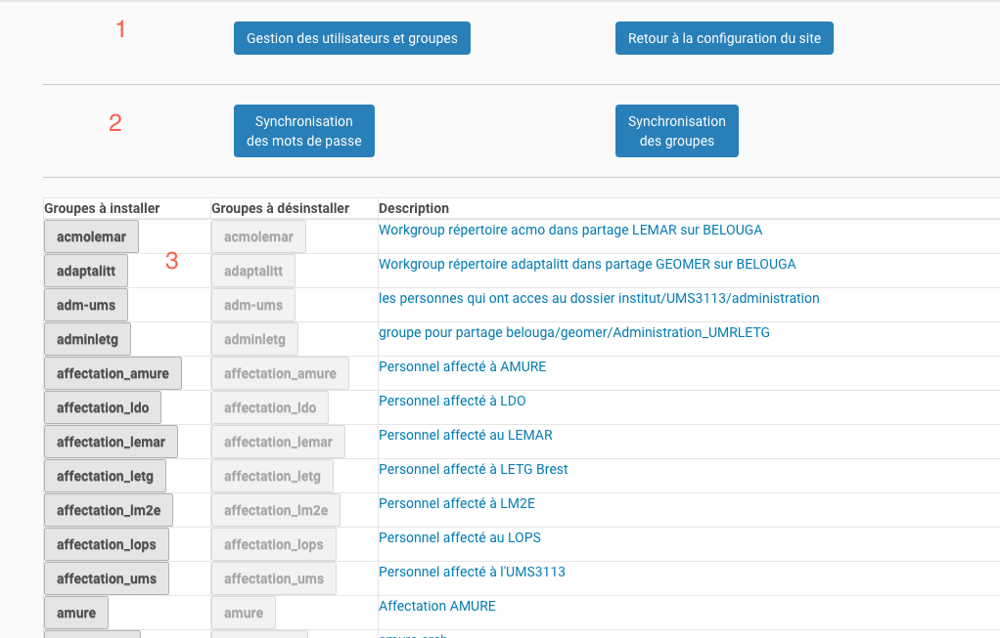

=============================
La vue de gestion des groupes
=============================

Accéder à la vue
================

Il s'agit ici de la page principale de gestion des groupes.

On y accède de deux façons possibles :

**par le panneau de contrôle de configuration de Plone**

   .. image:: usage3.png

**par le menu ``utilisateur``**
   qui se trouve en bas à gauche de la page, si celui-ci a le rôle ``IUEM Users Manager``
   (voir : :doc:`permissions`)

   .. image:: usage4.png

L'utilisation générale de la vue
================================

La vue est composée de 3 parties :

1. en haut, deux boutons pour accéder à la gestion des utilisateurs et groupes, et pour
   aller au panneau général de configuration du site
#. en dessous, deux boutons pour réaliser les opération particulières de synchronisation
   des mots de passe et des groupes
#. la partie d'installation/dé-sinstallation des groupes.

Les 4 boutons en haut de la page
================================

L'usage des 2 premiers boutons est implicite :

* l'accès à l'interface de gestion des utilisateurs et groupes de Plone : après avoir ajouté
  ou supprimer des éléments, cette interface permet une configuration plus fine, par exemple
  attributer un rôle particulier à un groupe.

* le panneau général de configuration du site qui ne sera accessible que si l'utilisateur a
  un rôle qui le permet.

Les deux autres boutons ont pour fonction de gérér la cohérence entre les comptes
utilisateurs et groupes locaux avec les comptes et groupes ``LDAP`` :

* la synchronisation des mots de passe n'est à utiliser que si l'on veut réaliser la mise à
  jour locale des mots de passe sans attendre qu'elle soit faite par ``cron``

* il en est de même pour la synchronisation des groupes : la composition des membres des groupes
  ``LDAP`` peut être mise à jour avant la synchronisation automatique

.. note:: ces opérations peuvent être assez longue si le nombre d'utilisateurs/groupes est important

L'installation des groupes
==========================

La troisième partie de cette vue est celle qui va permettre l'installation locale des groupes. Les comptes
d'utilisateurs sont gérés en fonction de ces groupes :

**Installation d'un groupe**

   * si les comptes des membres du groupe n'existent pas, ils sont créés.

   * si un compte existe déjà, le compte est *affecté* au groupe.
   
**La suppression d'un groupe**

   * si un compte d'utilisateur est présent dans un autre groupe, y compris un groupe *non LDAP*,
     le compte est conservé et est sorti du groupe.

   * si un compte n'est plus présent dans aucun groupe, il est supprimé.

L'utilisation de cette interface est simple :

* les boutons de la colone de gauche servent à installer localement un groupe. Si le bouton est
  désactivé, cela signifie que le groupe est installé

* les boutons de la colone de droite servent à désinstaller les groupes. Les boutons désactivés
  indiquent que le groupe n'est pas installé

* les liens dans la colone description permettent d'afficher dans une fenêtre *overlay* la
  liste des comptes du groupe concerné

